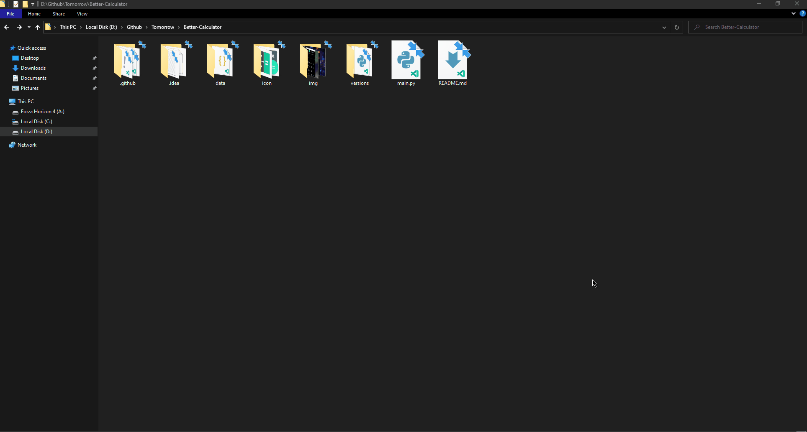
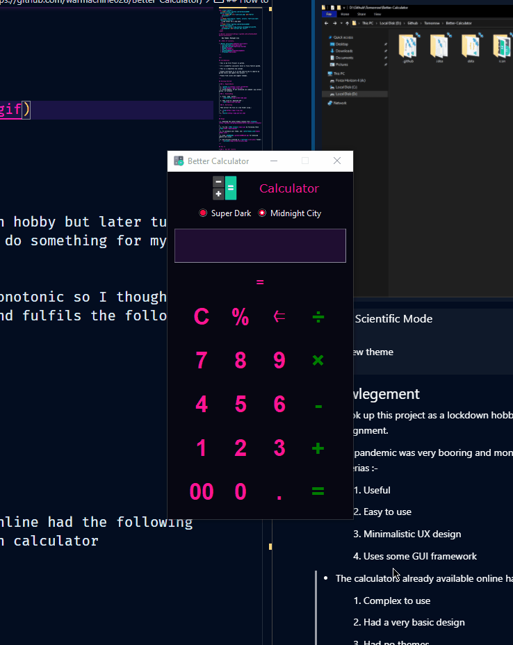
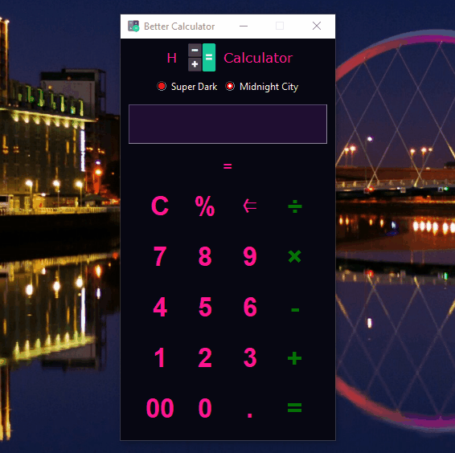
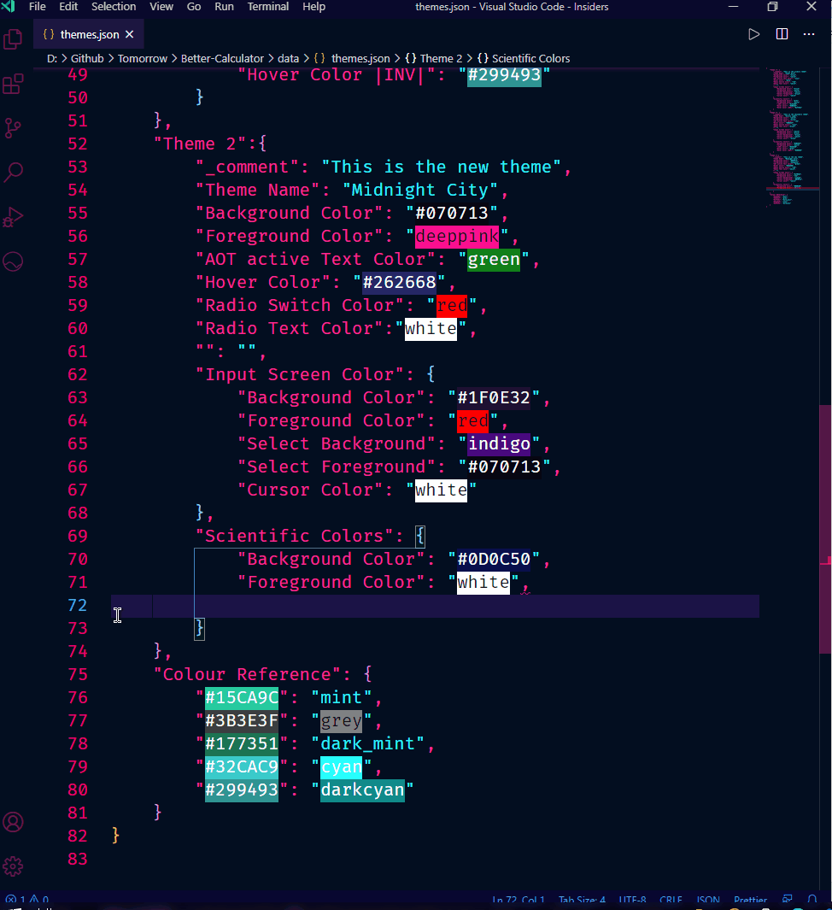
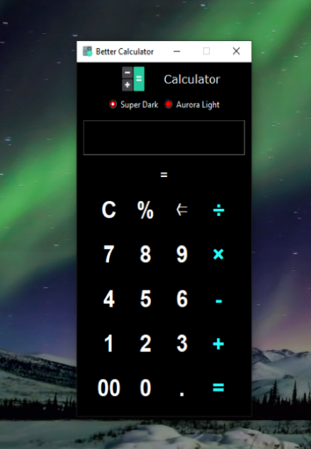
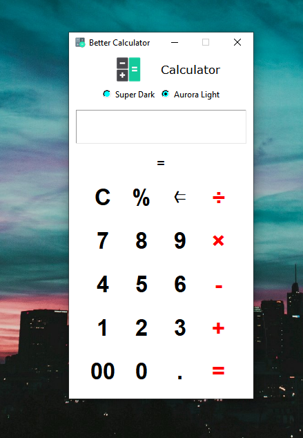
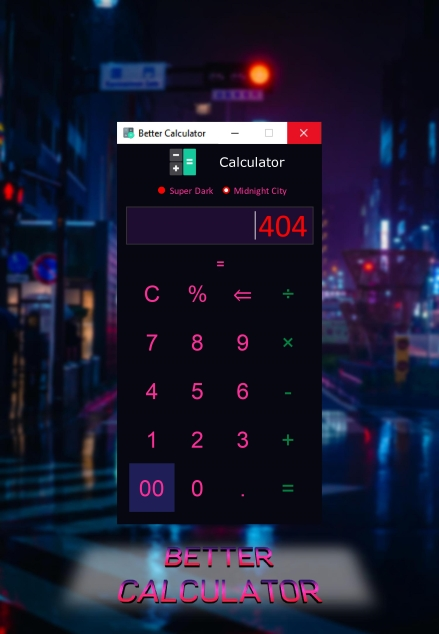

    updated: Monday, 13th September 2021

<div align=center>
    <a href="https://warmachine028.github.io/Better-Calculator"></a>
    <p style="font-family: roboto, calibri; font-size:12pt; font-style:italic"> Aesthetic outside Stronger inside </p>
    <a href="https://github.com/warmachine028/Better-Calculator/releases/"> </a>
    <br>
    <a href="https://github.com/warmachine028/Better-Calculator/releases/tag/V4.2.1-beta">  </a>
    <br>
    
    <a href= "https://github.com/warmachine028/Better-Calculator/blob/main/LICENSE"></a>
    <a href="https://github.com/warmachine028/Better-Calculator/network/members"></a>
</div>

# [Better Calculator](https://github.com/warmachine028/Better-Calculator)

## What's new?

- Added a new icon in README
- Addition of Clear History Feature
- Added 3 buttons to delete history
- Fixed Frames Overlap Scientific Frame

## Table of Contents

- [Introduction](#introduction)
- [Getting Started](#getting-started)
- [Usage](#usage)
- [How to](#how-to)
- [Customizations](#customizations)
- [Acknowledgement](#acknowledgement)
- [Previews](#previews)
- [Contributing](#contributing)
- [License](#License)

---

## Introduction

- This is my first Project in github.
- I'm trying to put all my dedication into it.
- It's a fully feature packed calculator.
- A completely new concept.
- Please contribute to it and show me how to imporve my github skills.
- Find issues and suggest changes.

---

## Getting Started

### Requirements

- [python 3.x] - Python 3 and above
- [PIL] for dealing with icons. If not installed

```sh
$ pip install pillow
```

### Clone this repository using the following command

- (nearly 20 MB)

```sh
$ git clone https://github.com/warmachine028/Better-Calculator
```

---

## Usage

1. Download the Latest Stable release from [releases].
2. Try the latest [BETA release].
3. Clone this Repo to contribute by following these [steps](#getting-started).
4. To customize your theme, see: [themes.json].
5. View [CHANGELOG] for detailed updates and issues.
6. Old versions archived in [versions] folder.

---

## How to

<details>
<summary> 1. Use AOT feature </summary>

AOT: Always On Top feature  
Press the icon beside the label <code class="language-plaintext highlighter-rouge">Calculator</code>  
<code class="language-plaintext highlighter-rouge">AOT ACTIVE</code>: colour of the label changes and becomes italic  
<code class="language-plaintext highlighter-rouge">AOT INACTIVE</code>: colour of label reverts and becomes normal


</details>

<details>
<summary> 2. Use Scientific Mode </summary>

Press the <code class="language-plaintext highlighter-rouge">=</code> button below Entry widget to open scientific menu  
To activate inverse Trigonometric Functions press <code class="language-plaintext highlighter-rouge">INV</code>     
<span style="color:green"> NOTE: </span>
**To use <u>factorial function</u> press <code class="language-plaintext highlighter-rouge">!</code> first and then enter the input.**


</details>

<details>
<summary> 3. Use History Feature </summary>

Press <code class="language-plaintext highlighter-rouge">H</code> button beside AOT button to view history.  
If log.txt is <i>Empty</i> the Labels will show: Not enough Data  
See the history of calculations in reverse order.


</details>

<details>
<summary> 4. Set a Custom theme </summary>

Open <i>data/themes.json</i>  
Rename <code class="language-plaintext highlighter-rouge">Theme 1</code> / <code class="language-plaintext highlighter-rouge">Theme 2</code> to the required themes


</details>

## Customizations

- Common attributes

| Attribute               | Description                                            |
| ----------------------- | :----------------------------------------------------- |
| `_comment`              | Short description about the theme                      |
| `Theme name`            | The name of theme which appears in the application     |
| `Background Color`      | The background color of the application                |
| `Foreground Color`      | The text-color of left buttons                         |
| `AOT active Text Color` | The accent color of the app                            |
|                         | > Text color of right side buttons                     |
|                         | > Text color of label: AOT active                      |
| `Hover Color`           | The color when mouse pointer is hovering above buttons |
| `Radio Switch Color`    | The color of theme changer (circular button)           |
| `Radio Text Color`      | The color of the text of theme changer                 |

- Input Screen

| Attribute           | Description                       |
| ------------------- | :-------------------------------- |
| `Background Color`  | The background of input screen    |
| `Foreground Color`  | The text-color of input screen    |
| `Select Background` | The background of selected text   |
| `Select Foreground` | The text color of selected text   |
| `Cursor Color`      | The color of cursor in the screen |

- Scientific Colors

| Attribute             | Description                                              |
| --------------------- | :------------------------------------------------------- |
| `Background Color`    | The background of scientific buttons                     |
| `Foreground Color`    | The text-color of scientific buttons                     |
| `\|INV\| Color`       | The color of Inverse Button when active                  |
| `Hover Color`         | The color when mouse pointer is above scientific buttons |
| `Hover Color \|INV\|` | The color when mouse is above "activated" inverse button |

### Demo



## Acknowledgement

- I took up this project as a lockdown hobby but later turned it into a serious project as I had to do something for my
  University Assignment.
- The pandemic was very boring and monotonic, so I thought of making something which is necessary and fulfils the
  following criterias :-

    1. Useful
    2. Easy to use
    3. Minimalistic UX design
    4. Uses some GUI framework

- Also, those days I couldn't find an appropriate calculator application online which suited my choice and designs.
- So I thought why not try to build one for myself and the community :)

## Previews

|               **Super Dark**               |            **Aurora Light**            |
| :----------------------------------------: | :------------------------------------: |
|  |  |
|             **Midnight City**              |            **COMMING SOON**            |
|  |                                        |

## Contributing

### How To contribute to this Project ?

- Fork this project
- Clone the repository remotely
- Create a new branch
- Make changes
- Push to your forked repository
- Create [PULL-REQUEST] here
- see [CONTRIBUTING]

## License

- see [LICENSE]

**Pritam, 2021**

<!-- Links  -->

[license]: https://github.com/warmachine028/Better-Calculator/blob/main/LICENSE

[contributing]: https://github.com/warmachine028/Better-Calculator/blob/main/.github/CONTRIBUTING.md

[releases]: https://github.com/warmachine028/Better-Calculator/releases

[website]: "https://warmachine028.github.io/Better-Calculator/"

[python 3.x]: https://www.python.org/downloads/release/python-396/

[pil]: https://pypi.org/project/Pillow

[beta release]: https://github.com/warmachine028/Better-Calculator/releases/tag/V4.2.1-beta

[themes.json]: https://github.com/warmachine028/Better-Calculator/blob/main/data/themes.json

[changelog]: https://github.com/warmachine028/Better-Calculator/blob/main/.github/CHANGELOG.md

[versions]: https://github.com/warmachine028/Better-Calculator/blob/main/data/versions

[PULL-REQUEST]:https://github.com/warmachine028/Better-Calculator/blob/main/.github/PULL_REQUEST_TEMPLATE.md
