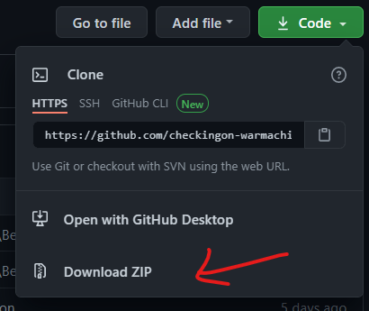
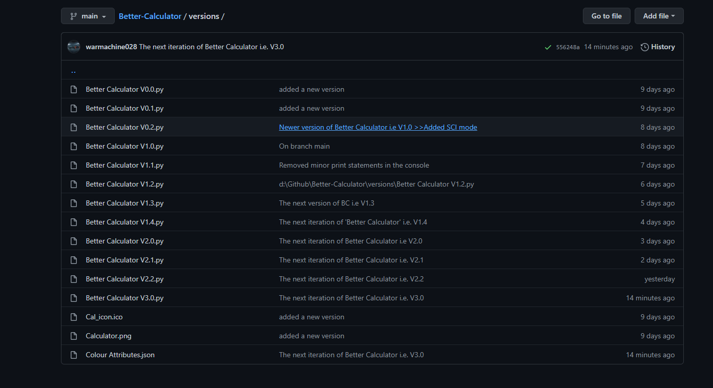
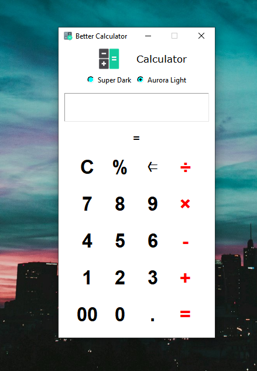
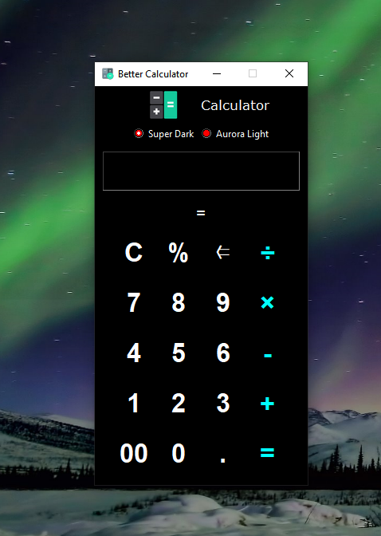
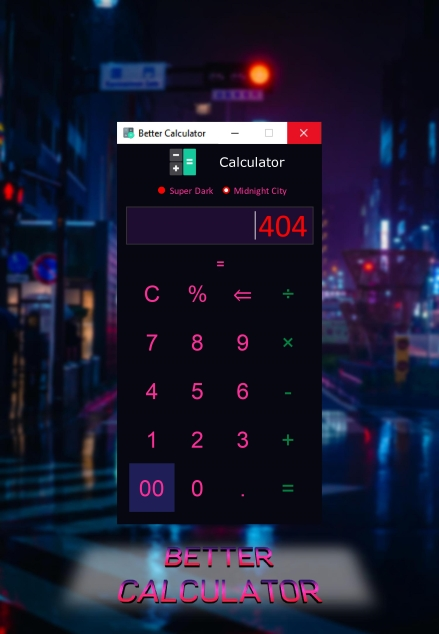

    updated: Thursday, 28th January 2021

<div align="center">
  <a href="https://github.com/warmachine028/Better-Calculator">
    
  </a>
  <p style="font-family: roboto, calibri; font-size:12pt; font-style:italic">
    A new colour for a new mood
  </p>
  <a href="https://github.com/warmachine028/Better-Calculator">
    
  </a>
</div>

# [Better Calculator](https://github.com/warmachine028/Better-Calculator)

    New theme: Midnight City

## _Table of Contents_

- [Better Calculator](#better-calculator)
  - [Introduction](#introduction)
  - [Getting Started](#getting-started)
  - [Usage](#usage)
  - [How to](#how-to)
  - [Customizations](#customizations)
  - [Acknowlegement](#acknowlegement)
  - [Previews](#previews)

---

<br>

## Introduction

- This is my first Project in github.  

- It's a wonderful calculator which is fully feature packed.  

- This is a completely new concept.  

- Please contribute to it 🙏 and show me how to imporve my github skills and update this project. :)  

- Please find issues and suggest changes.  

---

## Getting Started

> ### 1. Requirements
>
> 1. [python 3.x](https://cutt.ly/PjeYrSt)
> 2. [7zip](https://www.7-zip.org)
> 3. Pillow Module. If not installed use command `pip install pillow` in terminal
>
> ### 2. Downloading
>
> 1. Press `Code` button :
>    
>
> 2. Then click on `Download ZIP` :
>    
>
> ### 3. Extracting
>
> Then extract the file in a new folder using :
>
> 1. [7zip](https://www.7-zip.org)
>    or
> 2. [winrar](https://www.win-rar.com)

---

## Usage

> 1. Download the Latest Stable release from [releases](https://github.com/warmachine028/Better-Calculator/releases) .
>
> 2. Try the ['BETA release'](main.py) by following these [steps](###2.-downloading) .
>
> 3. To customize your theme, see: [data/themes.json](data/themes.json) .
>
> 4. View [CHANGELOG](.github/CHANGELOG.md) for detailed updates and issues .
>
> 5. Old versions archived in ['/versions'](versions) folder:
>    

---

## How to

> ### 1. use AOT feature
  >
  > Press the icon beside the label ```Calculator```  
  > ```AOT ACTIVE```: colour of the label changes and becomes italic  
  > ```AOT INACTIVE```: colour of label reverts and becomes normal  
  >
  >  
>
---

> ### 2. use Scientific Mode
  >
  > Press the ```=``` button below Entry widget to open scientific menu  
  > To activate inverse Trigonometric Functions press ```INV```  
  > To use factorial function press ```!``` first and then enter the input.  
  >
  >   
>
---

> ### 3. set a Custom theme
  >
  > Open _data/thems.json_  
  > Rename ```Theme 1``` / ```Theme 2``` to the required themes  
  >
  >   
---

## Customizations  

  

- Attributes:
  > ```_comment```: Short description about the theme  
  > ```Theme name```: The name of theme which appears in the application  
  > ```Background Color```: The background color of the application  
  > ```Foreground Color```: The text-color of left buttons  
  > ```AOT active Text Color```: The accent color of the app  
                                - Text color of right side buttons  
                                - Text color of label: AOT active  
  > ```Hover Color```: The color when mouse pointer is hovering above buttons  
  > ```Radio Switch Color```: The color of theme changer (circular button)  
  > ```Radio Text Color```: The color of the text of theme changer  
  >
  > Input Screen Color  
    ```Background Color```: The background of input screen  
    ```Foreground Color```: The text-color of input screen  
    ```Select Background```: The background of selected text  
    ```Select Foreground```: The text color of selected text  
    ```Cursor Color```: The color of cursor in the screen  
  >
  > Scientific Colors":  
    ```Background Color```: The background of scientific buttons  
    ```Foreground Color```: The text-color of scientific buttons  
    ```|INV| Color```: The color of Inverse Button when active  
    ```Hover Color```: The color when mouse pointer is above scientific buttons  
    ```Hover Color |INV|```: The color when mouse is above "activated" inverse button  
  
---

## Acknowlegement

- I took up this project as a lockdown hobby but later turned it into a serious project as I had to do something for my University Assignment.

- The pandemic was very booring and monotonic so I thought of making something which is necessary and fulfils the following criterias :-

  1. Useful

  2. Easy to use

  3. Minimalistic UX design

  4. Uses some GUI framework

- The calculators already available online had the following shortcommings according to my study on calculator applications :-

  1. Complex to use

  2. Had a very basic design

  3. Had no themes

  4. Had no special features

  5. Had no have Scientific mode

  6. Was not so user friendly

- Also those days I could'nt find an appropriate calculator application online which suited my choice and designs.

- So I thought why not try to build one for myself and the community. :)

## Previews

|              Aurora Light            |                Super Dark               |
| :----------------------------------: | :-------------------------------------: |
|  |  |
|            Midnight City             |
|        |
