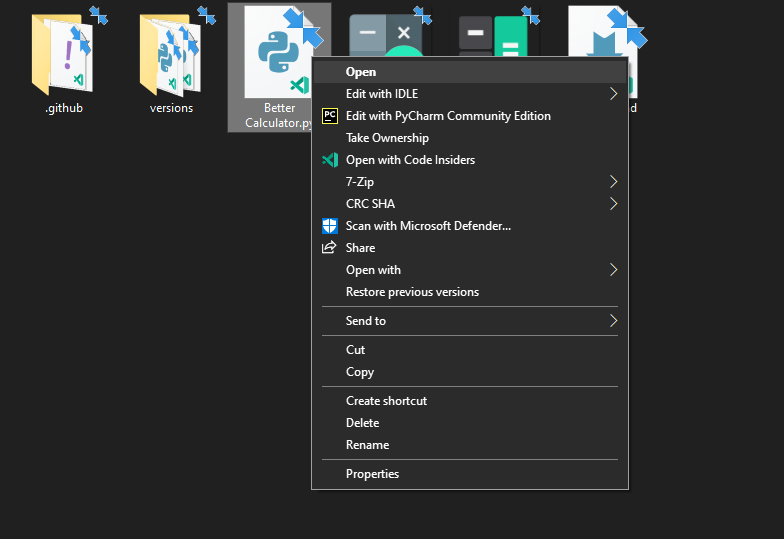
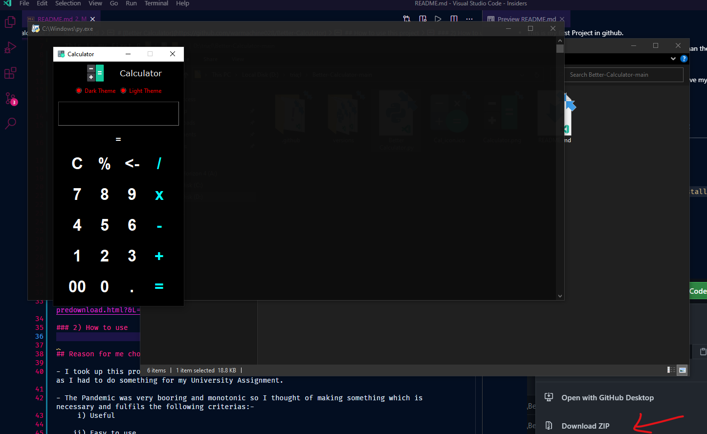

    updated: Tuesday, 29th December 2020

  
  

    A better and refined alternative
  

  

# [Better Calculator](https://github.com/warmachine028/Better-Calculator)

## _Table of Contents_

- [Introduction](#Introduction)
- [Getting Started](#Getting-Started)
  - [Requirements](#1.-Requirements)
  - [Downloading](#2.-Downloading)
  - [Extracting](#3.-Extracting)
- [Usage](#Usage)
- [Acknowlegement](#Acknowlegement)

---

 

## Introduction

- This is my first Project in github.

- It's a wonderful calculator which has better features than the conventional ones.

- This is a completely new concept.

- Please contribute to it 🙏 and show me how to imporve my github skills and update this project. :)

- Please find issues and suggest changes.

- Old versions archived in ['/versions'](https://github.com/warmachine028/Better-Calculator/tree/main/versions) folder

- Download the Latest version: [Better Calculator.py V2.2](https://github.com/warmachine028/Better-Calculator/blob/main/Better%20Calculator.py)

- View [CHANGELOG](.github/CHANGELOG.md)

---

## Getting Started

> ### 1. Requirements
>
> 1. [python 3.x](https://www.python.org/ftp/python/3.9.1/python-3.9.1-amd64.exe)
> 2. [7zip](https://www.7-zip.org/a/7z1900-x64.exe)
> 3. Pillow Module. If not installed use command `pip install pillow` in terminal
>
> ### 2. Downloading
>
> i. Press `Code` button :
> 
>
> ii. Then click on `Download ZIP` :
> 
>
> ### 3. Extracting
>
> Then extract the file in a new folder using :
> [7zip](https://www.7-zip.org/a/7z1900-x64.exe) or [winrar](https://www.win-rar.com/predownload.html?&L=0)

## Usage

> 1. Simply click 'Open':
>    
> 2. Then you can see this window:
>    

---

## Acknowlegement

- I took up this project as a lockdown hobby but later turned it into a serious project as I had to do something for my University Assignment.

- The Pandemic was very booring and monotonic so I thought of making something which is necessary and fulfils the following criterias :-

  i) Useful

  ii) Easy to use

  iii) Minimalistic UX design

  iv) Uses some GUI framework

- The calculators already available online had the following shortcommings according to my study on calculator applications :-

  i) Complex to use

  ii) Had a very basic design

  iii) Had no themes

  iv) Had no special features like AOT\*, Hover

  v) Had no have Scientific mode

  vi) Was not so user friendly

- Also those days I could'nt find an appropriate calculator application online which suited my choice and designs.

- So I thought why not try to build one for myself and the community. :)
