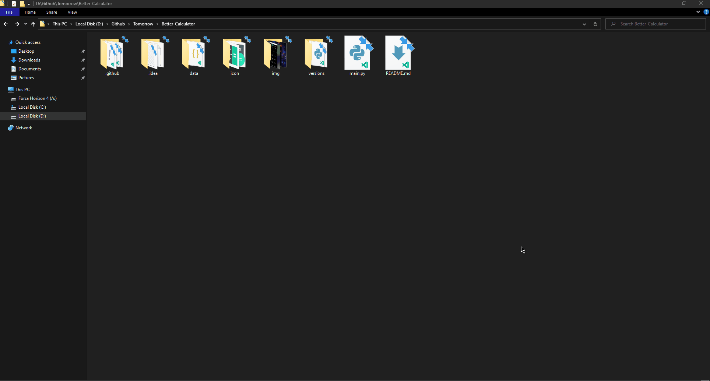
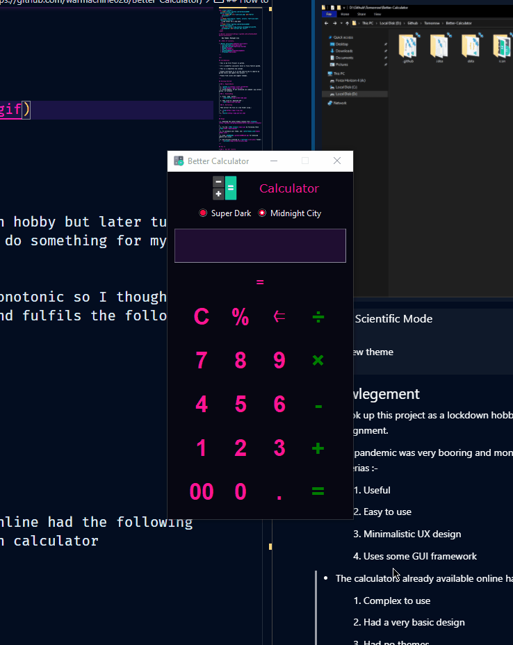
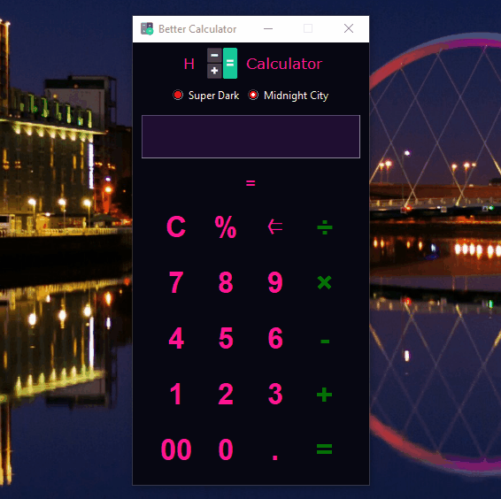
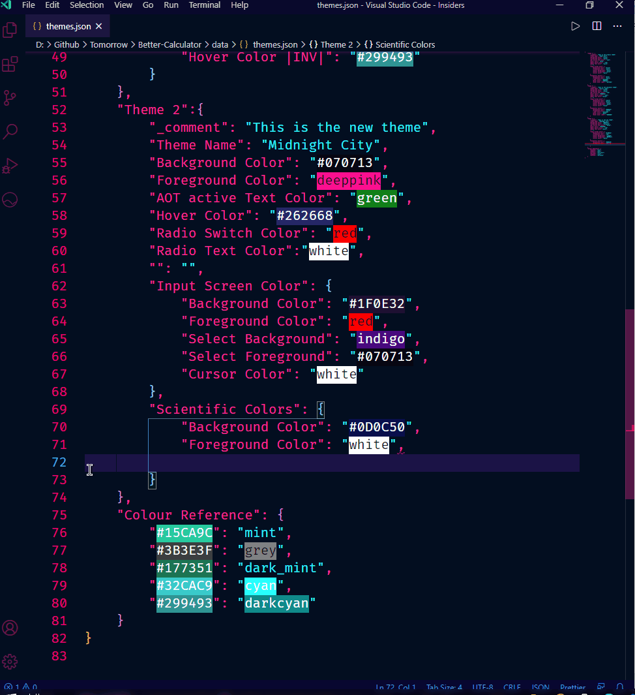

    updated: Thursday, 8th July 2021

<div align=center>
    <a href="https://warmachine028.github.io/Better-Calculator"></a>
    <p style="font-family: roboto, calibri; font-size:12pt; font-style:italic"> Aesthetic outside Stronger inside </p>
    <a href="https://github.com/warmachine028/Better-Calculator/releases/"> </a>   
    <br>
    <a> </a>
    <a href= "https://github.com/warmachine028/Better-Calculator/blob/main/LICENSE"></a>
    <a href="https://github.com/warmachine028/Better-Calculator/network/members"></a>
</div>
    

# [Better Calculator](https://github.com/warmachine028/Better-Calculator)

## Table of Contents

- [Introduction](#introduction)
- [Getting Started](#getting-started)
- [Usage](#usage)
- [How to](#how-to)
- [Customizations](#customizations)
- [Acknowlegement](#acknowlegement)
- [Previews](#previews)
- [License](#License)

---

<br>

## Introduction

- This is my first Project in github.
- I'm trying to put all my dedication into it.
- It's a fully feature packed calculator.
- A completely new concept.
- Please contribute to it and show me how to imporve my github skills.
- Find issues and suggest changes.

---

## Getting Started

### Requirements

- [python 3.x] - Python 3 and above
- [PIL] for dealing with icons. If not installed 
```sh 
$ pip install pillow
```

### Clone this repository using the following command

- (nearly 20 MB)

```sh
$ git clone https://github.com/warmachine028/Better-Calculator
```

---

## Usage

1. Download the Latest Stable release from [releases].
2. Try the ['BETA release'](main.py) by following these [steps](###2.-downloading) .
3. To customize your theme, see: [data/themes.json](data/themes.json) .
4. View [CHANGELOG](.github/CHANGELOG.md) for detailed updates and issues .
5. Old versions archived in ['/versions'](versions) folder:
   

---

## How to

> ### 1. use AOT feature
>
> Press the icon beside the label `Calculator`  
> AOT: Always On Top feature
> `AOT ACTIVE`: colour of the label changes and becomes italic  
> `AOT INACTIVE`: colour of label reverts and becomes normal  
>
> 

---

> ### 2. use Scientific Mode
>
> Press the `=` button below Entry widget to open scientific menu  
> To activate inverse Trigonometric Functions press `INV`  
> To use _factorial function_ press `!` first and then enter the input.
>
> 

---

> ### 3. use History Feature
>
> Press `H` button beside AOT button to view history.  
> if log.txt is NULL the Labels will show: Not enough Data  
> See the history of calculations in reverse order.
>
> 

---

> ### 4. set a Custom theme
>
> Open _data/themes.json_  
> Rename `Theme 1` / `Theme 2` to the required themes
>
> 

---

## Customizations



- Common attributes

| Attribute               | Description                                            |
| ----------------------- | :----------------------------------------------------- |
| `_comment`              | Short description about the theme                      |
| `Theme name`            | The name of theme which appears in the application     |
| `Background Color`      | The background color of the application                |
| `Foreground Color`      | The text-color of left buttons                         |
| `AOT active Text Color` | The accent color of the app                            |
|                         | > Text color of right side buttons                     |
|                         | > Text color of label: AOT active                      |
| `Hover Color`           | The color when mouse pointer is hovering above buttons |
| `Radio Switch Color`    | The color of theme changer (circular button)           |
| `Radio Text Color`      | The color of the text of theme changer                 |

- Input Screen

| Attribute           | Description                       |
| ------------------- | :-------------------------------- |
| `Background Color`  | The background of input screen    |
| `Foreground Color`  | The text-color of input screen    |
| `Select Background` | The background of selected text   |
| `Select Foreground` | The text color of selected text   |
| `Cursor Color`      | The color of cursor in the screen |

- Scientific Colors

| Attribute             | Description                                              |
| --------------------- | :------------------------------------------------------- |
| `Background Color`    | The background of scientific buttons                     |
| `Foreground Color`    | The text-color of scientific buttons                     |
| `\|INV\| Color`       | The color of Inverse Button when active                  |
| `Hover Color`         | The color when mouse pointer is above scientific buttons |
| `Hover Color \|INV\|` | The color when mouse is above "activated" inverse button |

---

## Acknowlegement

- I took up this project as a lockdown hobby but later turned it into a serious project as I had to do something for my University Assignment.
- The pandemic was very booring and monotonic so I thought of making something which is necessary and fulfils the following criterias :-

  1. Useful
  2. Easy to use
  3. Minimalistic UX design
  4. Uses some GUI framework

- Also those days I could'nt find an appropriate calculator application online which suited my choice and designs.
- So I thought why not try to build one for myself and the community :)

## Previews

|             **Super Dark**              |           **Aurora Light**           |
| :-------------------------------------: | :----------------------------------: |
|  |  |
|            **Midnight City**            |                                      |
|           |                                      |

## License

- see [LICENSE](LICENSE)

**Kryptonite, 2021**

<!-- Links  -->

[releases]: https://github.com/warmachine028/Better-Calculator/releases
[website]: "https://warmachine028.github.io/Better-Calculator/" 
[python 3.x]: https://www.python.org/downloads/release/python-396/
[pil]: https://pypi.org/project/Pillow
